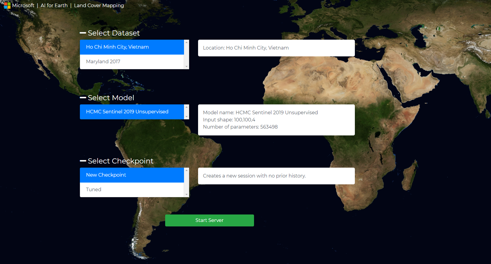
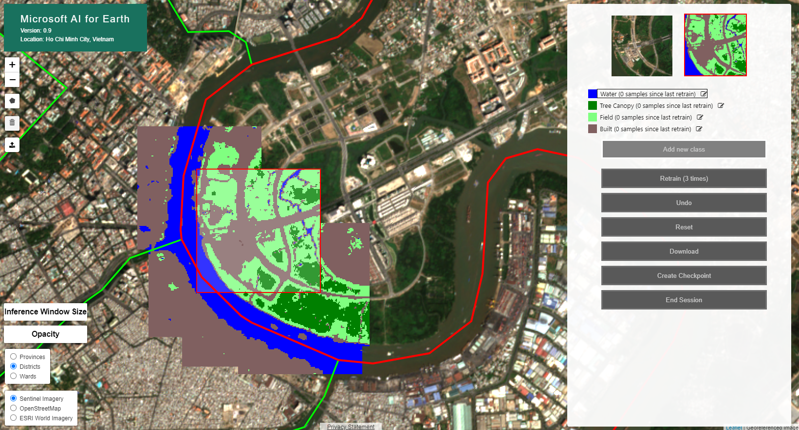

# Land cover mapping project

This repository holds both the _frontend_ web-application and _backend_ server that make up our "Land Cover Mapping" tool.


## Project setup instructions

- Open a terminal on the machine
- Install conda (note: if you are using a DSVM on Azure then you can skip this step as conda is preinstalled!)

```bash
# Install Anaconda
cd ~
wget https://repo.anaconda.com/archive/Anaconda3-2019.07-Linux-x86_64.sh
bash Anaconda3-2019.07-Linux-x86_64.sh # select "yes" for setting up conda init
rm Anaconda3-2019.07-Linux-x86_64.sh

# logout and log back in
exit
```

- Install NVIDIA drivers if you intend on using GPUs; note this might require a reboot (note: again, if you are using a DSVM on a Azure GPU VM then this is also handled)
- Setup the repository and install the demo data

```bash
# Get the project and demo project data
git clone https://github.com/microsoft/landcover.git

wget -O landcover.zip "https://mslandcoverstorageeast.blob.core.windows.net/web-tool-data/landcover.zip"
unzip -q landcover.zip
rm landcover.zip

# unzip the tileset that comes with the demo data
cd landcover/data/basemaps/
unzip -q hcmc_sentinel_tiles.zip
unzip -q m_3807537_ne_18_1_20170611_tiles.zip
rm *.zip
cd ../../../

# install the conda environment
# Note: if using a DSVM on Azure, as of 7/6/2020 you need to first run `sudo chown -R $USER /anaconda/`
# make sure conda-forge and pytorch are in the conda channel

conda config --append channels pytorch
conda config --append channels conda-forge

cd landcover
conda env create --file environment_precise.yml
cd ..
```

## Configuration instructions for the web-tool

A last step is required to configure the _backend_ server with the demo models/data.

Create local copies of `datasets.json`, `models.json` and `endpoints.js`. Edit `web_tool/endpoints.mine.js`. Replace "localhost" with the address of your machine (or leave it alone it you are running locally), and choose the port you will use (defaults to 8080). Note: make sure this port is open to your machine if you are using a remote sever (e.g. with a DSVM on Azure, use the Networking tab to open port 8080).

```bash
cp landcover/web_tool/datasets.json landcover/web_tool/datasets.mine.json
cp landcover/web_tool/models.json landcover/web_tool/models.mine.json
cp landcover/web_tool/endpoints.js landcover/web_tool/endpoints.mine.js
nano landcover/web_tool/endpoints.mine.js
```
### Adding new datasets

The _backend_ server looks for dataset definitions in two places: `web_tool/datasets.json` and `web_tool/datasets.mine.json`. The latter is included in `.gitignore` and is where you can add custom datasets following the template of the default datasets in `web_tool/datasets.json`.

For a dataset entry, the `dataLayer` can point to a .tif file or a .vrt file (GDAL Virtual Format) uniting a set of .tif files - anything that `rasterio` loads. The `dataLayer` needs to contain all the channels required by the model.

Path to data and shapefiles in this section, including the `url` of the `basemapLayers`, need to point to a location in the current directory so that the web server can serve the resources. If your data is mounted or stored elsewhere, you can create symbolic links to them from this directory.

### Adding new models

Similar to datasets, the _backend_ server looks for model definitions in two places: `web_tool/models.json` and `web_tool/models.mine.json`. The latter is included in `.gitignore` and is where you can add custom models following the template of the default datasets in `web_tool/models.json`. The only required field is `fn`, a path pointing to a model checkpoint.

The additional step you need to take for adding custom models is creating a class that extends `ModelSession` (from `web_tool/ModelSessionAbstract.py`) to wrap your custom model, then create a constructor in `worker.py` to handle your custom class type. Note: we have included implementations of `ModelSession` that handle standard use cases of Keras and PyTorch based models. The `ModelSession` interface exists to allow for easy customization of retraining and inference logic.

### Using GPU workers

- Edit `self._WORKERS` of the `SessionHandler` class in `SessionHandler.py` to include the GPU resources you want to use on your machine. By default this is set to use GPU IDs 0 through 4.


## Running an instance of the web-tool

Whether you configured the web-tool in an Azure VM or locally, the following steps should apply to start an instance of the _backend_ server:

- Open a terminal on the machine and `cd` to the root directory (`wherever/you/cloned/landcover/`)
- `conda activate landcover` 
- `python server.py`
  - This will start an HTTP server on :8080 that both serves the _frontend_ web-application and responds to API calls from the _frontend_, allowing the web-app to interface with models (i.e. the _backend_).
  - The web-tool comes preloaded with two datasets (defined in `web_tool/datasets.json`) and two models (defined in `web_tool/models.json`).
- You should now be able to visit `http://<your machine's address>:8080/` and see the _frontend_ web-application.

### Directions for using the _frontend_

The _frontend_ contains two pages: a landing page (Figure 1), and the web-application (Figure 2).

On the landing page you must select: a "dataset", a "model", and a "checkpoint" in order to start a session in the web application. Pressing "Start Server" will start a "Session" that is connected to a GPU or CPU resource and take you to the web-application page where you can interactively run inference with and fine-tune the selected model.

On the web-application page:
- Use "shift+click" to run inference with the model.
- Select a class from the list on the right side of the page and "click" within the area that you previously ran inference on (highlighted in red on the map) to provide a point examples of the selected class.
- Press the "Retrain" button or "r" to retrain the last layer of the model.
  - Note: You must add at least one sample from each class before retraining
  - In the demo models, retraining will completely overfit the last layer of the CNN using the cumulative provided point examples.
- Use "s" to toggle the opacity of the prediction layer on the map between 0 and 100.

<p align="center">
  
  <b>Figure 1. Landing page example</b>
</p>

<p align="center">
  
  <b>Figure 2. Web application example</b>
</p>
